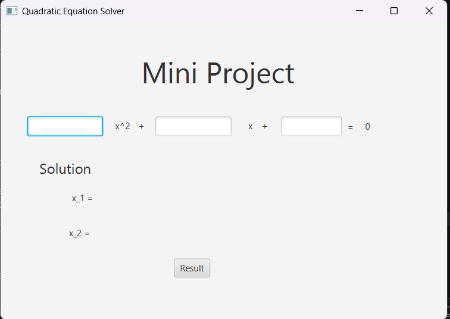
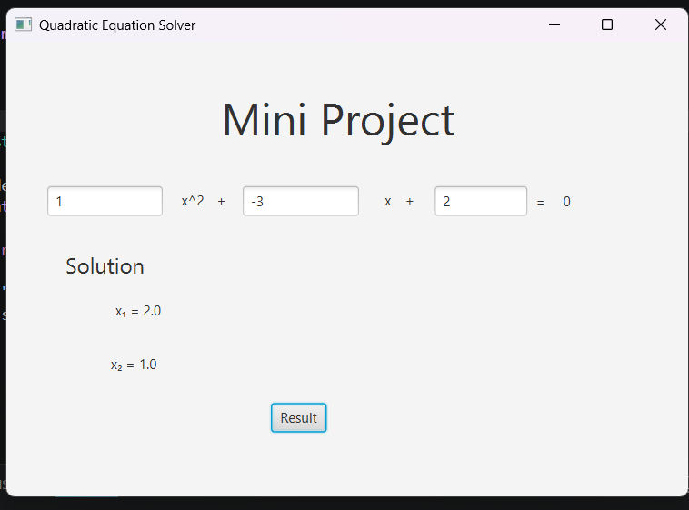

# PROJECT REPORT
## Quadratic Equation Calculator using Java OOP and Scene Builder

---

# 1. Project Information

**Project Title:** Quadratic Equation Calculator

**Course:** Object-Oriented Programming (OOP)

**Programming Language:** Java

**GUI Framework:** JavaFX with Scene Builder

**Date:** ______________________

---

# 2. Team Members

| No. | Name | Student ID |
|------|------|------------|
| 1 | TRY PHURI | e20231044 |
| 2 | Member 2 | e20230091 |
| 3 | Member 3 | e20230092 |
| 4 | Member 4 | e20230093 |

---

# 3. Task Distribution

| Member | Responsibility |
|----------|---------------|
| Member 1 | Project planning, requirement analysis, report writing |
| Member 2 | GUI design using Scene Builder and View.fxml |
| Member 3 | Java programming, controller implementation, and equation calculation |
| Member 4 | Testing, debugging, screenshot collection, and documentation |

---

# 4. Project Objective

The objective of this project is to develop a Quadratic Equation Calculator using Java Object-Oriented Programming (OOP) concepts and JavaFX Scene Builder.

The application allows users to input coefficients **a**, **b**, and **c** and calculate the roots of a second-degree equation:

**ax² + bx + c = 0**

The program automatically determines whether the equation has:

- Two distinct real roots
- One repeated real root
- No real roots

---

# 5. OOP Concepts Used

### Encapsulation
The program organizes data and methods inside Java classes such as `Main` and `controler`.

### Exception Handling
The application handles invalid user input using `try-catch` statements to prevent crashes.

### Event-Driven Programming
The calculation process is triggered when the user clicks the **Result** button.

---

# 6. System Design

## Input

- Coefficient a
- Coefficient b
- Coefficient c

## Process

1. Read values from text fields.
2. Calculate discriminant:

   Δ = b² − 4ac

3. Determine root type:
   - Δ > 0 → Two real roots
   - Δ = 0 → One repeated root
   - Δ < 0 → No real roots

4. Display the result.

## Output

- x₁ and x₂ values
- No Real Solution
- Invalid Input

---

# 7. Program Interface

## Main Window

### Screenshot of GUI



---

## Result Example

### Screenshot of Result




---

# 8. Source Code

## 8.1 Main.java

```java
import javafx.application.Application;
import javafx.fxml.FXMLLoader;
import javafx.scene.Scene;
import javafx.stage.Stage;

public class Main extends Application {

    public static void main(String[] args) {
        launch(args);
    }

    @Override
    public void start(Stage stage) throws Exception {

        FXMLLoader loader = new FXMLLoader();
        loader.setLocation(getClass().getResource("viewtwo.fxml"));

        Scene scene = new Scene(loader.load());

        stage.setTitle("Quadratic Equation Solver");
        stage.setScene(scene);
        stage.show();
    }
}
```

---

## 8.2 controler.java

```java
import javafx.fxml.FXML;
import javafx.scene.control.Button;
import javafx.scene.control.Label;
import javafx.scene.control.TextField;

public class controler {

    @FXML
    private TextField text_field_1;

    @FXML
    private TextField text_field_2;

    @FXML
    private TextField text_field_3;

    @FXML
    private Label label_1;

    @FXML
    private Label label_2;

    @FXML
    private Button botton_1;

    @FXML
    private void calculate() {

        try {

            double a = Double.parseDouble(text_field_1.getText());
            double b = Double.parseDouble(text_field_2.getText());
            double c = Double.parseDouble(text_field_3.getText());

            double delta = b * b - 4 * a * c;

            if (delta > 0) {

                double x1 = (-b + Math.sqrt(delta)) / (2 * a);
                double x2 = (-b - Math.sqrt(delta)) / (2 * a);

                label_1.setText("x₁ = " + x1);
                label_2.setText("x₂ = " + x2);

            } else if (delta == 0) {

                double x = -b / (2 * a);

                label_1.setText("x₁ = " + x);
                label_2.setText("x₂ = " + x);

            } else {

                label_1.setText("No Real Solution");
                label_2.setText("");

            }

        } catch (Exception e) {

            label_1.setText("Invalid Input");
            label_2.setText("");

        }
    }
}
```

---

## 8.3 viewtwo.fxml

```xml
<?xml version="1.0" encoding="UTF-8"?>

<?import javafx.scene.control.Button?>
<?import javafx.scene.control.Label?>
<?import javafx.scene.control.TextField?>
<?import javafx.scene.layout.AnchorPane?>
<?import javafx.scene.text.Font?>

<AnchorPane maxHeight="-Infinity" maxWidth="-Infinity" minHeight="-Infinity" minWidth="-Infinity"
            prefHeight="400.0" prefWidth="600.0"
            xmlns="http://javafx.com/javafx/23.0.1"
            xmlns:fx="http://javafx.com/fxml/1"
            fx:controller="controler">

   <children>

      <Label layoutX="189.0" layoutY="40.0" text="Mini Project">
         <font>
            <Font size="39.0" />
         </font>
      </Label>

      <TextField fx:id="text_field_1"
                 layoutX="36.0"
                 layoutY="127.0"
                 prefHeight="26.0"
                 prefWidth="101.0" />

      <Label layoutX="154.0" layoutY="131.0" text="x^2" />
      <Label layoutX="185.0" layoutY="131.0" text="+" />

      <TextField fx:id="text_field_2"
                 layoutX="208.0"
                 layoutY="127.0"
                 prefHeight="26.0"
                 prefWidth="102.0" />

      <Label layoutX="333.0" layoutY="131.0" text="x" />
      <Label layoutX="351.0" layoutY="131.0" text="+" />

      <TextField fx:id="text_field_3"
                 layoutX="377.0"
                 layoutY="127.0"
                 prefHeight="26.0"
                 prefWidth="81.0" />

      <Label layoutX="466.0" layoutY="132.0" text="=" />
      <Label layoutX="490.0" layoutY="132.0" text="0" />

      <Label layoutX="52.0" layoutY="183.0" text="Solution">
         <font>
            <Font size="19.0" />
         </font>
      </Label>

      <Label fx:id="label_1"
             layoutX="96.0"
             layoutY="228.0"
             text="x_1 = " />

      <Label fx:id="label_2"
             layoutX="92.0"
             layoutY="275.0"
             text="x_2 =" />

      <Button fx:id="botton_1"
              layoutX="233.0"
              layoutY="318.0"
              mnemonicParsing="false"
              onAction="#calculate"
              text="Result" />

   </children>
</AnchorPane>
```

---

# 9. Testing

| Input (a,b,c) | Expected Result | Actual Result | Status |
|--------------|----------------|---------------|---------|
| 1, -3, 2 | x₁ = 2, x₂ = 1 | x₁ = 2, x₂ = 1 | Pass |
| 1, 2, 1 | x₁ = -1, x₂ = -1 | x₁ = -1, x₂ = -1 | Pass |
| 1, 1, 1 | No Real Solution | No Real Solution | Pass |
| a, b, c | Invalid Input | Invalid Input | Pass |

---

# 10. Challenges Encountered

- Understanding JavaFX and Scene Builder.
- Connecting GUI components with the controller.
- Implementing quadratic equation calculations correctly.
- Handling invalid user inputs.

---

# 11. Conclusion

The Quadratic Equation Calculator was successfully developed using Java Object-Oriented Programming and JavaFX Scene Builder. The application provides a simple graphical interface that allows users to enter coefficients and obtain solutions to quadratic equations. The project enhanced the team's understanding of Java programming, GUI development, event handling, and exception handling.

---

# 12. References

1. Java Documentation
2. JavaFX Documentation
3. Scene Builder Documentation
4. Course Materials

---